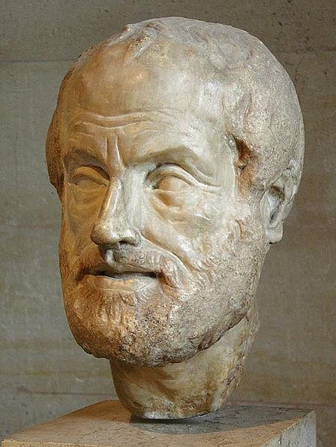

<!-- configuracion de colores es opcional pero ultil-->
<section id="themes">
	<h2>Themes setting</h2>
	

		Themes:  
		<a href="?#/themes">Default</a> -
		<a href="?theme=sky#/themes">Sky</a> -
		<a href="?theme=beige#/themes">Beige</a> -
		<a href="?theme=simple#/themes">Simple</a> -
		<a href="?theme=serif#/themes">Serif</a> -
		<a href="?theme=night#/themes">Night</a>  
		<a href="?theme=moon#/themes">Moon</a> -
		<a href="?theme=solarized#/themes">Solarized</a>
	

</section>

Slide:    

##Narrativa vs Ludología

##Linealidad vs Interactividad

Profesor:

Oscar Andrade Medina

Slide:

[Aristóteles](http://es.wikipedia.org/wiki/Arist%C3%B3teles)

[La poética](http://www.ugr.es/~encinas/Docencia/Aristoteles_Poetica.pdf) (335 A.C.)

Mímesis (imitación)

Ritmo

Lenguaje

Armonía

Épica (superior a nosotros)

Drama (igual a nosotros)

Comedia (inferior a nosotros)

Slide:
##Estamos en construcción

 

